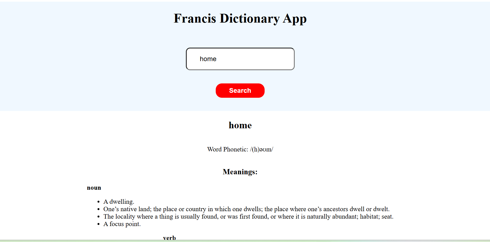

# React + Vite

## 📚 Dictionary App

A simple and powerful Dictionary App built with React.js that allows users to search for any English word and get its definition, phonetic transcription, and part of speech. The app fetches data from the Free Dictionary API (https://dictionaryapi.dev/****************) and displays the results in a clean and organized manner.

## 🎯 Features

✅ Search for any word in English✅ Displays word phonetics✅ Shows multiple definitions with part of speech✅ User-friendly interface✅ Handles errors for invalid words

## 🛠️ Technologies Used

React.js (Hooks)

Fetch API for data fetching

HTML5 & CSS3

## 🖼️ Demo Screenshot

🚀 How to Run the Project Locally

Clone the repository:

  git clone https://github.com/FrancisNgochoMuraya/dictionary-app.git

Navigate to the project directory:

  cd dictionary-app

Install dependencies:

  npm install

🎯 Future Improvements

Add support for other languages

Include audio pronunciation

Improve UI design and animation

✨ Developed with ❤️ by Francis Ngocho Muraya
